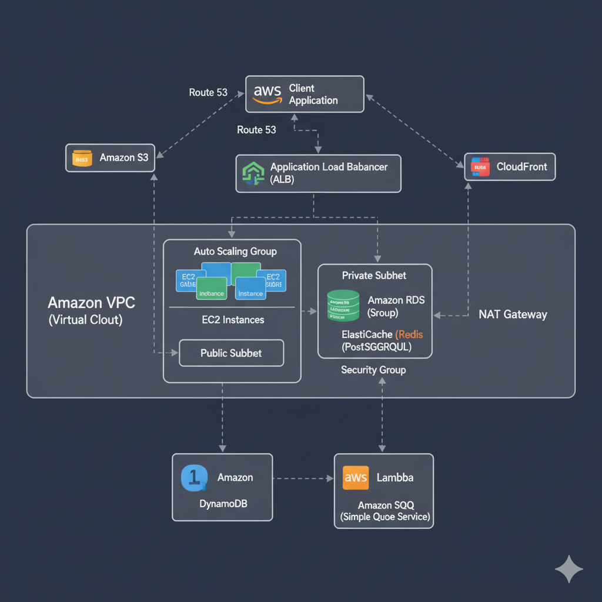

# aws-arquitetura-simples
# Arquitetura AWS – Exemplo com S3, Lambda e EC2

Este repositório contém um diagrama de arquitetura desenvolvido para representar uma aplicação simples utilizando serviços da **Amazon Web Services (AWS)**.

---

☁️ Componentes da Arquitetura

1. **Usuário (User)**  
   Interage com a aplicação por meio da web.

2. **Amazon CloudFront**  
   Serviço de CDN (Content Delivery Network) responsável por entregar o conteúdo rapidamente ao usuário.

3. **Amazon S3 (Simple Storage Service)**  
   Utilizado para armazenar arquivos e conteúdo estático da aplicação.

4. **AWS Lambda**  
   Responsável por processar eventos e executar código sob demanda, sem necessidade de servidor dedicado.

5. **Amazon EC2 (Elastic Compute Cloud)**  
   Instância que executa aplicações, APIs ou serviços de backend.

---

## 🔄 Fluxo da Arquitetura

---

## 🖼️ Diagrama

---

## 👩🏻‍💻 Autora

**Maria Luiza Mendonça**  
Instrutora de Programação | Estudante de Segurança da Informação  
Apaixonada por tecnologia, automação e cibersegurança 🔐

